<p align="right"><strong>English</strong> · <a href="./README.zh-CN.md">简体中文</a></p>

# Wedding Invitation

> An AI-agent skill that designs your wedding invitation from a conversation — any language, any aesthetic, rendered locally, never uploaded.


<p align="center">
  
  
  
  
</p>

## Quick start

```bash
git clone https://github.com/wyx-sg/wedding-invitation-skill \
  ~/.claude/skills/wedding-invitation
```

Then in [Claude Code](https://claude.ai/code), say:

> Help me make a wedding invitation.

Claude takes it from there. No restart needed — Claude Code picks up new skills in the current session.

## What you'll get

- A **bespoke HTML template** designed for you — not picked from a gallery
- A **print-ready PNG** at 1080×1440 (or 1080×1920 for 9:16 poster format)
- Designed in **your language(s)** — English, Chinese, Spanish, Japanese, Korean, or any combination
- Your photos, names, and address **never leave your machine**

## Gallery

The 15 invitations below are **Chinese examples** showing what aesthetics this skill can produce. They are not templates you pick from — each one was designed from scratch for a different aesthetic. Your invitation will be designed fresh in your chosen language.

<table>
  <tr>
    <td align="center">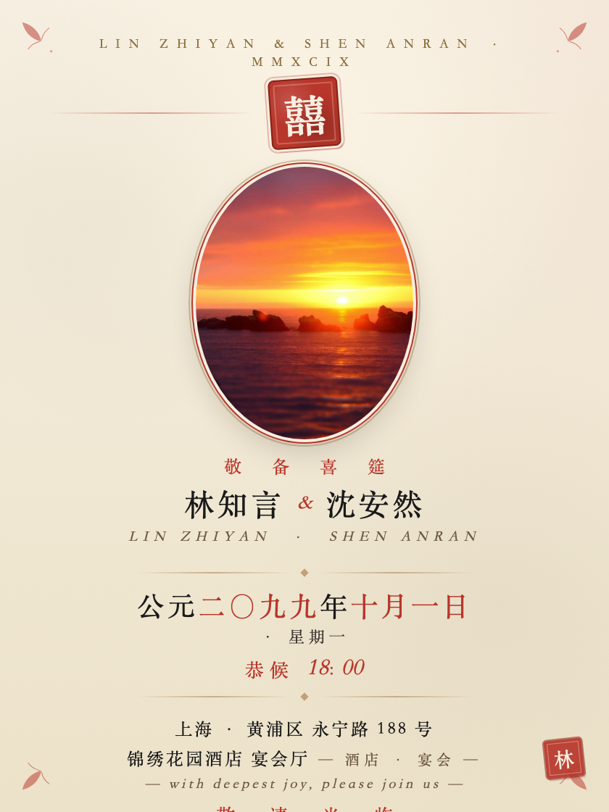<br><sub><b>new-chinese</b><br>refined traditional</sub></td>
    <td align="center">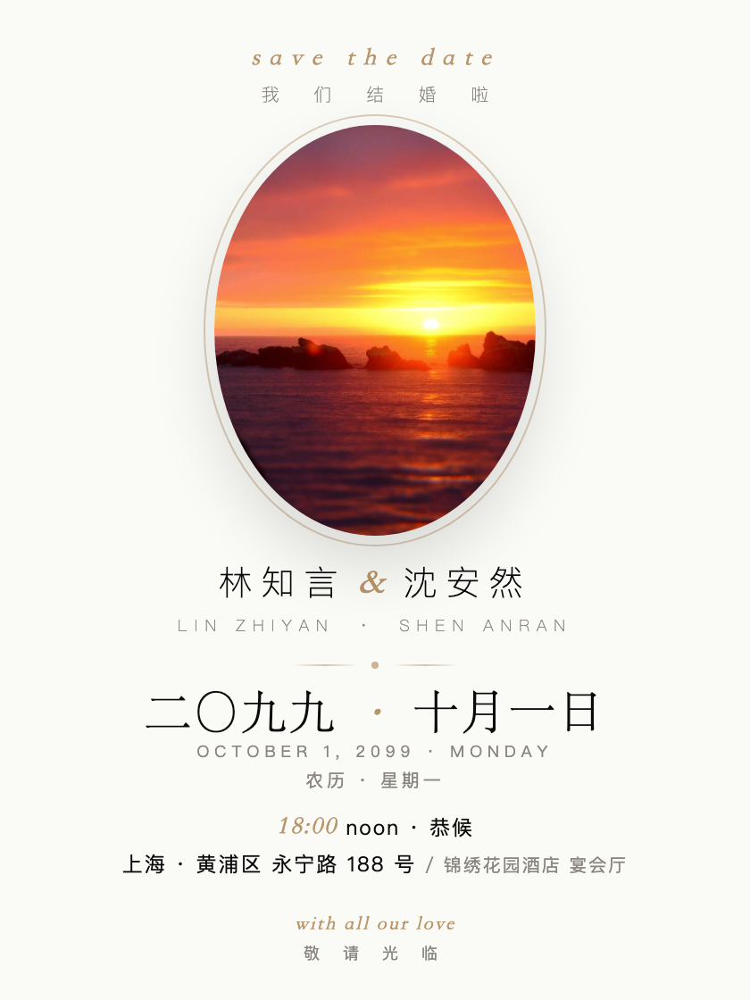<br><sub><b>modern-minimal</b><br>scandi minimalism</sub></td>
    <td align="center">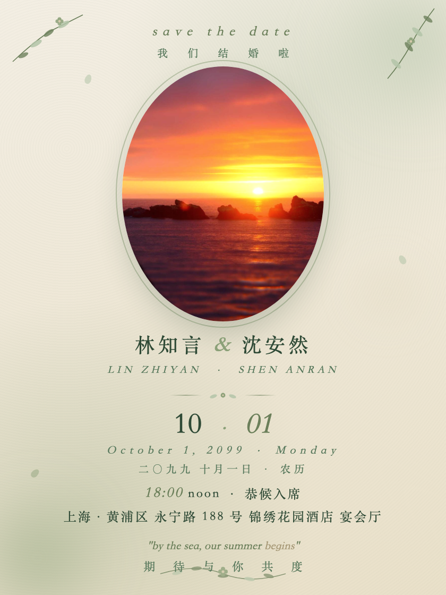<br><sub><b>morandi</b><br>soft contemporary</sub></td>
    <td align="center">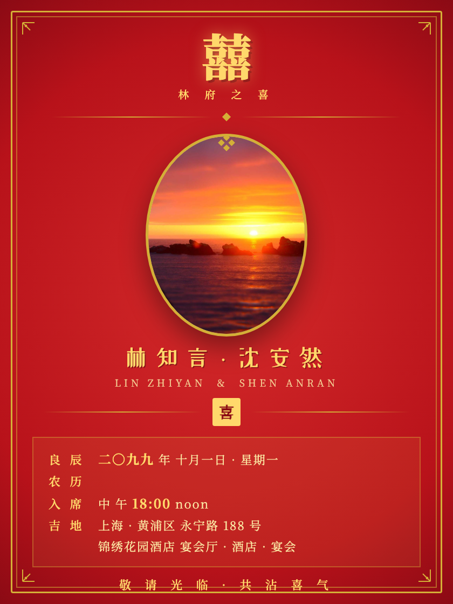<br><sub><b>red-gold</b><br>traditional banquet</sub></td>
    <td align="center">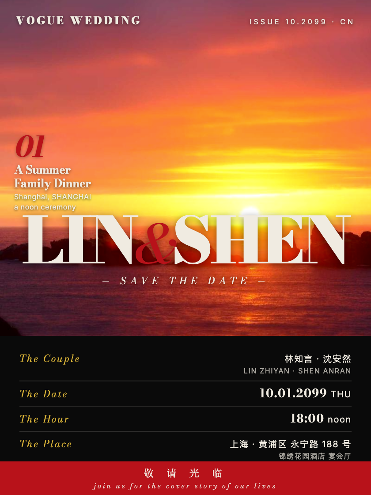<br><sub><b>vogue</b><br>editorial / fashion</sub></td>
  </tr>
  <tr>
    <td align="center">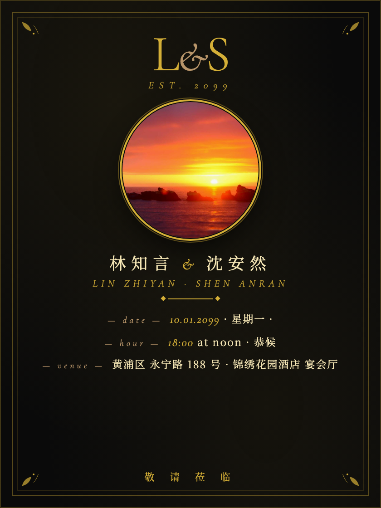<br><sub><b>black-gold</b><br>monogram / formal</sub></td>
    <td align="center">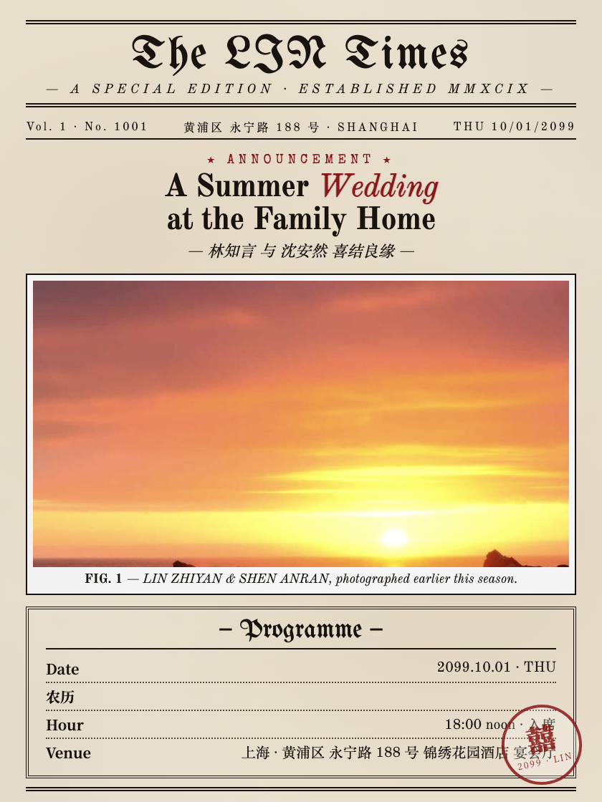<br><sub><b>newspaper</b><br>old-print broadsheet</sub></td>
    <td align="center">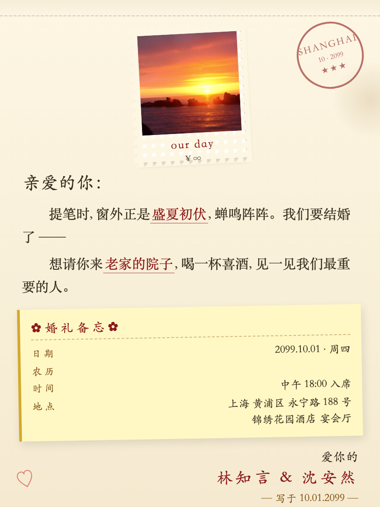<br><sub><b>letter</b><br>handwritten note</sub></td>
    <td align="center">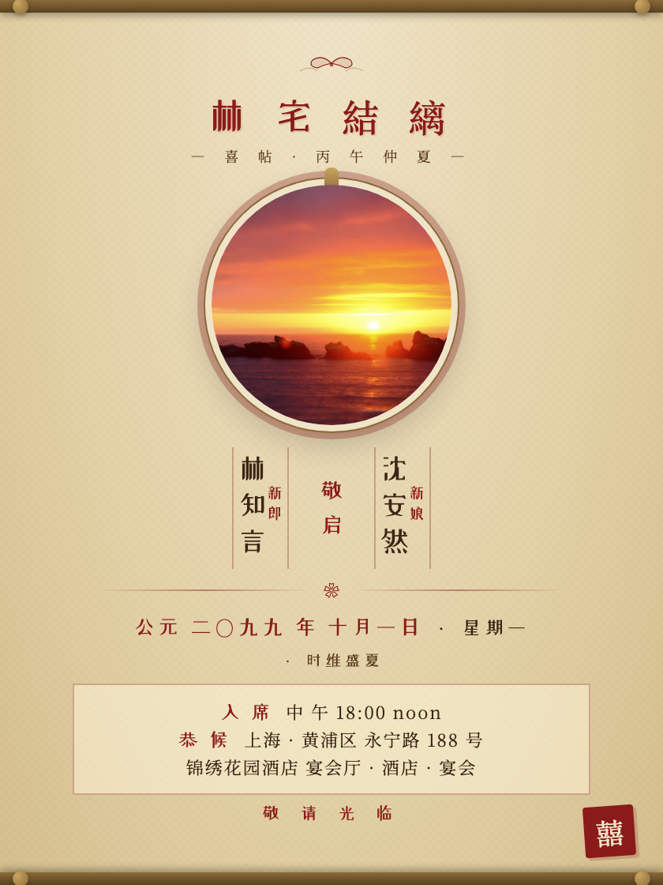<br><sub><b>gugong</b><br>palace / museum</sub></td>
    <td align="center"><br><sub><b>mediterranean</b><br>destination / outdoor</sub></td>
  </tr>
  <tr>
    <td align="center">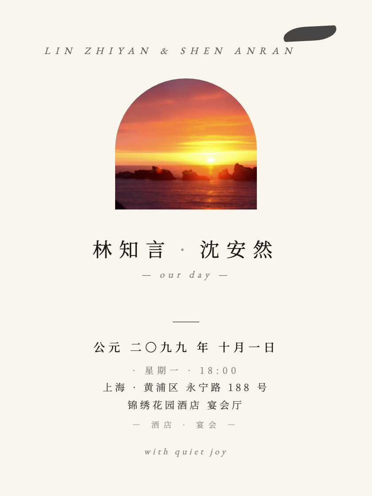<br><sub><b>wabi-sabi</b><br>japanese restraint</sub></td>
    <td align="center">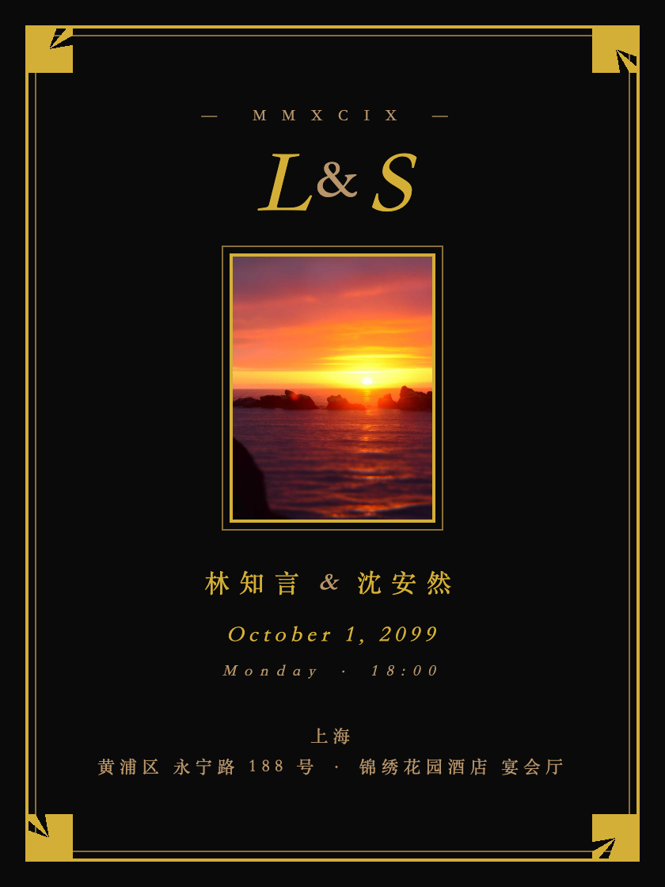<br><sub><b>art-deco</b><br>gatsby glamour</sub></td>
    <td align="center">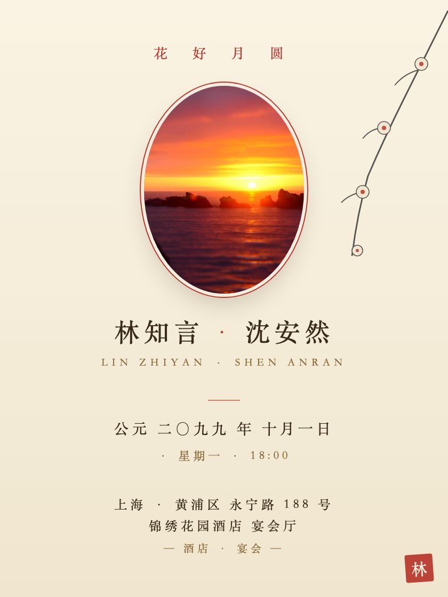<br><sub><b>ink-flower</b><br>chinese ink painting</sub></td>
    <td align="center">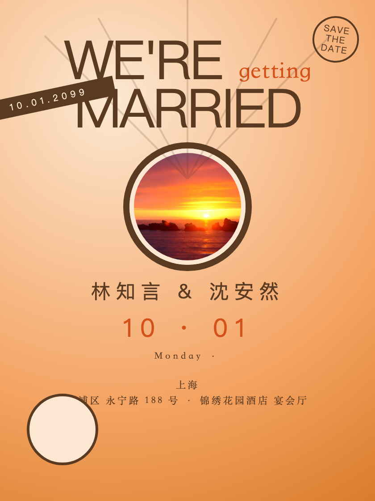<br><sub><b>retro-poster</b><br>travel-poster</sub></td>
    <td align="center">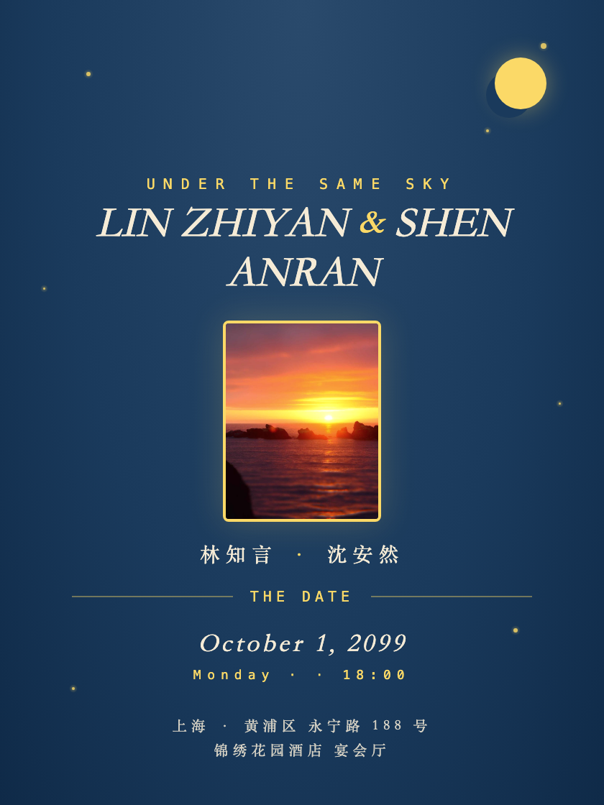<br><sub><b>vintage-stars</b><br>celestial / night</sub></td>
  </tr>
</table>

## How it works

1. **Talk** — Claude asks your language(s), names, date, venue, style preference
2. **Preview** — Claude shows aesthetic directions visually in your browser
3. **Design** — Claude writes a unique HTML template from scratch in your language
4. **Iterate** — you say "bigger font" / "softer color" / "swap the photo"; Claude tweaks
5. **Export** — one command screenshots the HTML into a high-res print-ready PNG

## Requirements

- **Node.js 18+**
- **Google Chrome, Chromium, or Microsoft Edge** — used to render the PNG. The skill ships with a cross-platform Node script (`render.js`) that locates whichever you have.
- **macOS, Linux, or Windows**

If you don't have a Chromium-family browser, the skill prints install instructions for your OS.

## Use with other coding agents

| Agent | How to use |
|---|---|
| **Claude Code** | First-class — auto-discovers the skill after `git clone` |
| **Claude Agent SDK** | Supported |
| Cursor / Aider / Codex CLI / Gemini CLI / others | Clone anywhere; tell the agent: "read `SKILL.md` and help me make a wedding invitation" |

Some interactions use Claude Code's `AskUserQuestion` tool for visual picking; other agents automatically fall back to plain text.

## Privacy

Your photos, names, and address never leave your machine.

- The skill itself makes **zero network requests**.
- At preview time, the rendered HTML loads webfonts from `fonts.font.im` (a Google Fonts mirror) — only your browser sees that, and only the font URLs. You can pre-download fonts to go fully offline.
- The project directory's `.gitignore` excludes `photos/`, `data/wedding.json`, and `dist/` by default — so even if you `git init` your wedding project, your data won't be tracked.
- No telemetry, no analytics, no third-party services.

## FAQ

**Can I use this without Claude Code?**
Yes. Any coding agent that reads markdown works — you just need to manually point it at `SKILL.md`. Auto-discovery is Claude Code specific.

**Is this a website?**
No. It produces a static PNG you can print, share, attach to email, or send via messaging apps.

**What languages does it support?**
Anything. The skill asks at the start. Chinese, English, Spanish, Japanese, Korean, French, bilingual combinations — `design-principles.md` has typography guidance for the major scripts.

**Can I use my own photos?**
Yes. The skill asks where they live on your machine and copies them into the project.

**Will my data appear anywhere online?**
No. The project directory is `.gitignore`'d by default. Your photos and details stay local.

**What if I'm on Windows?**
Works. `render.js` shells out to whichever Chrome / Chromium / Edge you have installed. The skill's documentation includes Windows commands alongside macOS/Linux.

## License

MIT — see [LICENSE](./LICENSE).
