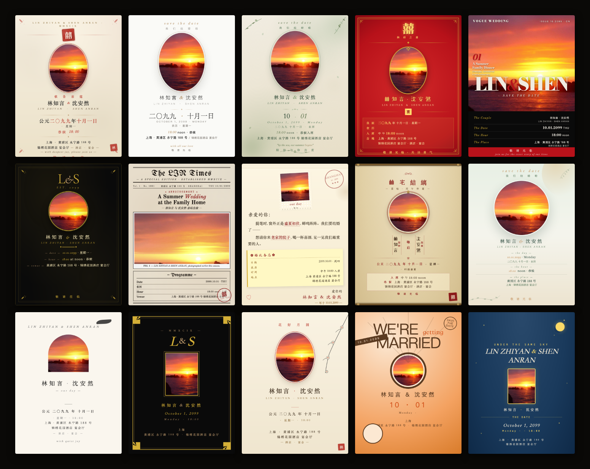
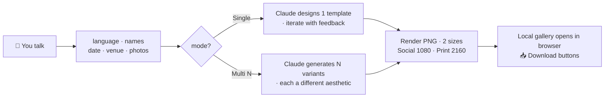

<p align="right"><strong>English</strong> · <a href="./README.zh-CN.md">简体中文</a></p>

# Wedding Invitation

[](https://github.com/wyx-sg/wedding-invitation-skill/releases/latest/download/wedding-invitation-skill.zip)

> An AI-agent skill that designs your wedding invitation from a conversation — any language, any aesthetic, rendered locally, never uploaded.

**🎨 [Open the live gallery](https://wyx-sg.github.io/wedding-invitation-skill/)** — click any of the 20 examples to see it rendered full-size.

[](https://wyx-sg.github.io/wedding-invitation-skill/)

<p align="center">
  <a href="https://wyx-sg.github.io/wedding-invitation-skill/"></a>
  
  
  
  
</p>

## Install

### Option 1 — Download the release zip (recommended for users)

```bash
# Latest release
curl -L https://github.com/wyx-sg/wedding-invitation-skill/releases/latest/download/wedding-invitation-skill.zip -o wedding-invitation-skill.zip
unzip wedding-invitation-skill.zip
# Result: ./wedding-invitation-skill/ — copy or symlink this into wherever Claude Code looks for skills.
```

The release zip is small (under 100 KB) and contains only the runtime files: `SKILL.md`, `workflow.md`, `design-principles.md`, `LICENSE`, `references/`, `skeleton/`. It does NOT include `examples/`, `docs/`, `__test__/`, or maintainer scripts.

### Option 2 — Clone the source (for skill authors / contributors)

```bash
git clone https://github.com/wyx-sg/wedding-invitation-skill \
  ~/.claude/skills/wedding-invitation
```

The repo includes additional folders that you don't need to use the skill but that are useful if you want to contribute:
- `examples/` — 20 showcase invitations (source of truth for the README gallery)
- `docs/` — the GitHub Pages site, generated from `examples/` via `scripts/build-pages.js`
- `__test__/tweak-fixture/` — end-to-end test fixture
- `scripts/` — maintainer build tools

### Requirements

- Node.js 18+
- A Chromium-family browser (Google Chrome, Chromium, or Microsoft Edge) — used by `render.js` for PNG export.
- macOS, Linux, or Windows

If you don't have a Chromium-family browser, the skill prints install instructions for your OS.

Then in [Claude Code](https://claude.ai/code), invoke the skill:

```
/wedding-invitation
```

Or just tell Claude: "Help me make a wedding invitation." Either way works — Claude takes it from there. No restart needed.

## What you'll get

- A **bespoke HTML design** created for you — not picked from a generic gallery
- **Two PNG sizes per design** — 1080×1440 for messaging/email, 2160×2880 at 300 DPI for printing
- A **local gallery page** that opens in your browser with download buttons
- Designed in **your language(s)** — English, Chinese, Spanish, Japanese, Korean, French, Hindi, Arabic, or any combination
- Your photos, names, and address **never leave your machine**

You pick a **mode** at the start:

- **Single design + iterate** (default) — Claude designs one template tailored to you and refines with your feedback. ~30 minutes, 3-5 rounds.
- **Multiple alternatives** — Claude generates 3 / 5 / 8 different aesthetics in parallel using your actual data. You browse them in a local gallery and either download a favorite or pick one to keep iterating.

The 20 examples in the image above span world cultures and contemporary aesthetics, showing the visual range available:

- **Chinese** — `new-chinese`, `red-gold`, `gugong`, `ink-flower`
- **Japanese** — `wabi-sabi`
- **Korean** — `korean-hanbok`
- **South Asian** — `indian`
- **Middle Eastern** — `arabic`
- **Latin / Mexican** — `latin`
- **European** — `french-provence`, `art-deco`, `vogue`, `newspaper`, `letter`
- **Contemporary** — `morandi`, `modern-minimal`, `mediterranean`, `black-gold`
- **Themed** — `retro-poster`, `vintage-stars`

Whatever mode you pick, each invitation is custom-designed from scratch — not pulled from a template library.

## How it works



1. **Talk** — Claude asks your language(s), names, date, venue
2. **Pick style direction(s)** — Claude curates 5 aesthetic candidates that fit your photos and shows them in your browser; pick one or several (multi-select)
3. **Design** — Claude writes a fresh HTML template per direction you picked
4. **Open gallery** — `dist/index.html` opens with each design as a card; click any to view, download (Social 1080×1440 / Print 2160×2880), or tweak (live color/font/frame switchers)
5. **Iterate via chat** — for things the tweak panel can't do ("bigger font", "swap the photo", "rewrite layout") tell Claude; rebuilds + refresh

## Use with other coding agents

| Agent | How to use |
|---|---|
| **Claude Code** | First-class — auto-discovers the skill after `git clone` |
| **Claude Agent SDK** | Supported |
| Cursor / Aider / Codex CLI / Gemini CLI / others | Clone anywhere; tell the agent: "read `SKILL.md` and help me make a wedding invitation" |

Some interactions use Claude Code's `AskUserQuestion` tool for visual picking; other agents automatically fall back to plain text.

## Privacy

Your photos, names, and address stay on your laptop. No uploads. No cloud accounts. No telemetry. No third-party services.

The skill makes zero network requests of its own. The only thing that hits the network is your browser loading webfonts from Google Fonts during HTML preview — and that's just font URLs, nothing about you.

## FAQ

<details>
<summary><b>Can I use this without Claude Code?</b></summary>

Yes. Any coding agent that reads markdown works — you just need to manually point it at `SKILL.md`. Auto-discovery is Claude Code specific.

</details>

<details>
<summary><b>Is this a website?</b></summary>

No. It produces a static PNG you can print, share, attach to email, or send via messaging apps.

</details>

<details>
<summary><b>What languages does it support?</b></summary>

Anything. The skill asks at the start. Chinese, English, Spanish, Japanese, Korean, French, bilingual combinations — `design-principles.md` has typography guidance for the major scripts.

</details>

<details>
<summary><b>Can I use my own photos?</b></summary>

Yes. The skill asks where they live on your machine and copies them into the project.

</details>

<details>
<summary><b>What if I'm on Windows?</b></summary>

Works. `render.js` shells out to whichever Chrome / Chromium / Edge you have installed. Bash-only commands in the skill docs all have Windows PowerShell equivalents.

</details>

## License

MIT — see [LICENSE](./LICENSE).
