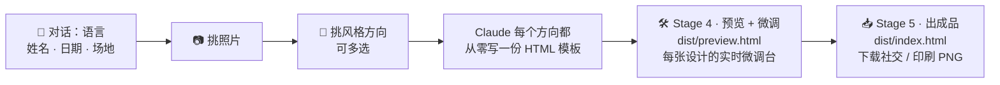

<p align="right"><a href="./README.md">English</a> · <strong>简体中文</strong></p>

# 婚礼请帖

[](https://github.com/wyx-sg/wedding-invitation-skill/releases/latest/download/wedding-invitation-skill.zip)

> 一个 AI agent skill，通过对话为你设计专属婚礼请帖 — 任意语言、任意风格、本地渲染、数据不外传。

**🎨 [打开在线 gallery](https://wyx-sg.github.io/wedding-invitation-skill/index.zh.html)** — 点任意一张样例看完整渲染效果。

[](https://wyx-sg.github.io/wedding-invitation-skill/index.zh.html)

<p align="center">
  <a href="https://wyx-sg.github.io/wedding-invitation-skill/index.zh.html"></a>
  
  
  
  
</p>

## 快速开始

把最新 release 解压到你编程 agent 的 skill 目录。以 [Claude Code](https://claude.ai/code) 为例：

```bash
mkdir -p ~/.claude/skills && cd ~/.claude/skills
curl -L https://github.com/wyx-sg/wedding-invitation-skill/releases/latest/download/wedding-invitation-skill.zip -o wedding-invitation-skill.zip
unzip -o wedding-invitation-skill.zip
```

然后跟你的 agent 说"帮我做一张婚礼请帖" —— skill 会接管对话。

release zip 在 100 KB 以内，只包含运行时所需文件：`SKILL.md`、`workflow.md`、`design-principles.md`、`LICENSE`、`references/`、`skeleton/`。

### 系统要求

- Node.js 18+
- Chromium 系浏览器（Google Chrome、Chromium 或 Microsoft Edge）— `render.js` 用来导出 PNG。如果没装，skill 会按你的操作系统打印安装指引。
- macOS、Linux 或 Windows

### 想贡献代码？直接 clone 源码

```bash
git clone https://github.com/wyx-sg/wedding-invitation-skill
```

仓库包含以下额外目录，使用 skill 时不需要，但贡献代码时有用：
- `examples/` — 20 张展示请帖（README gallery 的原始素材）
- `docs/` — GitHub Pages 站点，由 `scripts/build-pages.js` 从 `examples/` 生成
- `__test__/tweak-fixture/` — 端到端测试 fixture
- `scripts/` — 维护者构建工具

## 你将得到

- 一张**为你专属设计**的 HTML 请帖 — 而不是从模板库里挑一张
- **每张请帖两个尺寸的 PNG** — 1080×1440（社交版，微信/邮件）+ 2160×2880（印刷版，300 DPI）
- **本地浏览器微调台** — 实时切配色 / 字体 / 相框 / 可选组件，不用重 build
- 用**你选择的语言**设计 — 中文、英文、西班牙文、日文、韩文、法文、印地、阿拉伯，或任意组合
- 你的照片、姓名、地址**全程不出本机**

**生成几张设计取决于你选几个风格方向。** 选 1 个 → 1 张；选 3 个 → 3 张并排在 gallery 里。也可以让 Claude 跳过候选 picker，从对话沟通你的想法开始设计。

上图中 20 张样例覆盖了世界各种文化和当代风格，展示能做到什么程度：

- **中式** — `新中式`、`传统红金`、`故宫工笔`、`水墨花卉`
- **日式** — `侘寂`
- **韩式** — `Hanbok`
- **南亚** — `印度`
- **中东** — `阿拉伯`
- **拉美** — `Latin / 墨西哥民俗`
- **欧式** — `法式普罗旺斯`、`Art Deco`、`时尚杂志`、`复古报纸`、`手写信笺`
- **当代** — `莫兰迪`、`现代极简`、`地中海`、`黑金`
- **主题** — `复古海报`、`复古星空`

每张请帖都是从零定制的 — 不是从模板库里抓的。

## 工作流程



1. **对话** — 语言、姓名、日期、场地
2. **挑照片** — Claude 把你给的所有照片做成卡片；点击多选（或"全选"）。第一张作为主图，其他作为可切换的备选
3. **挑风格方向** — Claude 看你的照片挑出 5 个最匹配的方向；可单选可多选。回复"换一批"换 5 个新的（已选的不会被换），或者直接在对话里说"我想自定义"，跳过候选 picker，从对话开始设计你想要的方向
4. **设计** — Claude 为每个方向都从零写一份 HTML 模板
5. **预览 + 微调**（Stage 4 — `dist/preview.html`）— 每张设计的实时 iframe 缩略图；点卡片进**微调台**，切配色 / 字体 / 相框 / 显示隐藏。微调结果自动保存到本地文件，Claude 看得到。微调台搞不定的事跟 Claude 说就行
6. **出成品**（Stage 5 — `dist/index.html`）— 最终 gallery（PNG 缩略图），点卡片进详情页，**社交版** (1080×1440) + **印刷版** (2160×2880) 下载按钮。看完想再调？随时跳回 Stage 4

## 隐私

照片、姓名、地址全程不出本机。不上传、不开账号、没有埋点、没有第三方服务。

skill 自己完全不请求网络。唯一会走网络的是浏览器预览时加载 Google Fonts — 也只是字体 URL，不含任何你的数据。

## 常见问题

<details>
<summary><b>不用 Claude Code 能用吗？</b></summary>

能。任何能读 markdown 的编程 agent 都能用，只是需要手动指它读 `SKILL.md`。自动发现是 Claude Code 独有的能力。

</details>

<details>
<summary><b>这是个网站吗？</b></summary>

不是。它产出一张静态 PNG，你可以打印、分享、加邮件附件，或者通过即时通讯软件发出去。

</details>

<details>
<summary><b>支持哪些语言？</b></summary>

任意语言。skill 一上来就会问。中文、英文、西班牙文、日文、韩文、法文，或者双语组合都行 — `design-principles.md` 里收录了主要文字系统的排印指引。

</details>

<details>
<summary><b>能用我自己的照片吗？</b></summary>

能。skill 会问你照片在本机的什么位置，然后复制到项目里。

</details>

<details>
<summary><b>Windows 上能跑吗？</b></summary>

能。`render.js` 会调用你装的 Chrome / Chromium / Edge。skill 文档里的 bash 命令都有对应的 PowerShell 写法。

</details>

## 许可

MIT — 见 [LICENSE](./LICENSE)。
