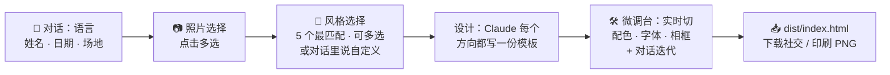

<p align="right"><a href="./README.md">English</a> · <strong>简体中文</strong></p>

# 婚礼请帖

[](https://github.com/wyx-sg/wedding-invitation-skill/releases/latest/download/wedding-invitation-skill.zip)

> 一个 AI agent skill，通过对话为你设计专属婚礼请帖 — 任意语言、任意风格、本地渲染、数据不外传。

**🎨 [打开在线 gallery](https://wyx-sg.github.io/wedding-invitation-skill/index.zh.html)** — 点任意一张样例看完整渲染效果。

[](https://wyx-sg.github.io/wedding-invitation-skill/index.zh.html)

<p align="center">
  <a href="https://wyx-sg.github.io/wedding-invitation-skill/index.zh.html"></a>
  
  
  
  
</p>

## 安装

### 方案 1 — 下载 release zip（推荐用户使用）

```bash
# 最新版本
curl -L https://github.com/wyx-sg/wedding-invitation-skill/releases/latest/download/wedding-invitation-skill.zip -o wedding-invitation-skill.zip
unzip wedding-invitation-skill.zip
# 结果：./wedding-invitation-skill/ — 将此目录复制或软链到 Claude Code 读取 skill 的位置。
```

release zip 体积小（100 KB 以内），仅包含运行时所需文件：`SKILL.md`、`workflow.md`、`design-principles.md`、`LICENSE`、`references/`、`skeleton/`。不含 `examples/`、`docs/`、`__test__/` 及维护者脚本。

### 方案 2 — 克隆源码（供 skill 作者 / 贡献者使用）

```bash
git clone https://github.com/wyx-sg/wedding-invitation-skill \
  ~/.claude/skills/wedding-invitation
```

仓库包含以下额外目录，使用 skill 时不需要，但贡献代码时有用：
- `examples/` — 20 张展示请帖（README gallery 的原始素材）
- `docs/` — GitHub Pages 站点，由 `scripts/build-pages.js` 从 `examples/` 生成
- `__test__/tweak-fixture/` — 端到端测试 fixture
- `scripts/` — 维护者构建工具

### 系统要求

- Node.js 18+
- Chromium 系浏览器（Google Chrome、Chromium 或 Microsoft Edge）— `render.js` 用于 PNG 导出。
- macOS、Linux 或 Windows

如果你没装 Chromium 系浏览器，脚本会按你的操作系统打印安装指引。

然后在 [Claude Code](https://claude.ai/code) 里调用 skill：

```
/wedding-invitation
```

或者直接说"帮我做一张婚礼请帖"。两种都行 — Claude 会接着引导对话，不需要重启 Claude Code。

## 你将得到

- 一张**为你专属设计**的 HTML 请帖 — 而不是从模板库里挑一张
- **每张请帖两个尺寸的 PNG** — 1080×1440（社交版，微信/邮件）+ 2160×2880（印刷版，300 DPI）
- **本地展示页** — 在浏览器里打开，配下载按钮
- 用**你选择的语言**设计 — 中文、英文、西班牙文、日文、韩文、法文、印地、阿拉伯，或任意组合
- 你的照片、姓名、地址**全程不出本机**

开始时你选一种**模式**：

- **单张深度打磨**（默认）— Claude 为你设计一张，结合你的反馈反复打磨。约 30 分钟，3-5 轮迭代。
- **多张对比**— Claude 并行生成 3 / 5 / 8 张不同 aesthetic 的设计，全部用你的真实数据。你在本地 gallery 里浏览，下载最喜欢的，或者挑一张继续打磨。

上图中 20 张样例覆盖了世界各种文化和当代风格，展示能做到什么程度：

- **中式** — `新中式`、`传统红金`、`故宫工笔`、`水墨花卉`
- **日式** — `侘寂`
- **韩式** — `Hanbok`
- **南亚** — `印度`
- **中东** — `阿拉伯`
- **拉美** — `Latin / 墨西哥民俗`
- **欧式** — `法式普罗旺斯`、`Art Deco`、`时尚杂志`、`复古报纸`、`手写信笺`
- **当代** — `莫兰迪`、`现代极简`、`地中海`、`黑金`
- **主题** — `复古海报`、`复古星空`

每张请帖都是从零定制的 — 不是从模板库里抓的。可单选可多选，挑几张就生成几张。

## 工作流程



1. **对话** — 语言、姓名、日期、场地、照片
2. **挑照片** — Claude 把所有照片做成卡片，你点击多选（或一键"全选"）。第一张作为主图，其他作为备选
3. **挑风格方向** — Claude 看你的照片挑出 5 个最匹配的方向，浏览器里展示；可单选可多选。回复"换一批"换 5 个新的，或回复"自定义"跳过候选直接对话沟通你的想法
4. **设计** — Claude 为每个你挑的方向都从零写一份 HTML 模板
5. **微调 + 迭代** — `dist/index.html` 在浏览器里打开，每张设计都是一张卡片，点进去查看 + 下载（Social 1080×1440 / Print 2160×2880）；进微调台可以实时切配色/字体/相框/组件；微调台搞不定的跟 Claude 说就行
6. **下载** — 详情页直接点 Social 或 Print 按钮

## 兼容其他编程 agent

| Agent | 使用方式 |
|---|---|
| **Claude Code** | 原生支持 — `git clone` 之后自动发现 |
| **Claude Agent SDK** | 支持 |
| Cursor / Aider / Codex CLI / Gemini CLI / 其他 | 任意路径 clone，告诉 agent："读一下 `SKILL.md`，然后帮我做一张请帖" |

部分交互用了 Claude Code 专属的 `AskUserQuestion` 工具做视觉选择；其他 agent 会自动降级为纯文本提问。

## 隐私

照片、姓名、地址全程不出本机。不上传、不开账号、没有埋点、没有第三方服务。

skill 自己完全不请求网络。唯一会走网络的是浏览器预览时加载 Google Fonts — 也只是字体 URL，不含任何你的数据。

## 常见问题

<details>
<summary><b>不用 Claude Code 能用吗？</b></summary>

能。任何能读 markdown 的编程 agent 都能用，只是需要手动指它读 `SKILL.md`。自动发现是 Claude Code 独有的能力。

</details>

<details>
<summary><b>这是个网站吗？</b></summary>

不是。它产出一张静态 PNG，你可以打印、分享、加邮件附件，或者通过即时通讯软件发出去。

</details>

<details>
<summary><b>支持哪些语言？</b></summary>

任意语言。skill 一上来就会问。中文、英文、西班牙文、日文、韩文、法文，或者双语组合都行 — `design-principles.md` 里收录了主要文字系统的排印指引。

</details>

<details>
<summary><b>能用我自己的照片吗？</b></summary>

能。skill 会问你照片在本机的什么位置，然后复制到项目里。

</details>

<details>
<summary><b>Windows 上能跑吗？</b></summary>

能。`render.js` 会调用你装的 Chrome / Chromium / Edge。skill 文档里的 bash 命令都有对应的 PowerShell 写法。

</details>

## 许可

MIT — 见 [LICENSE](./LICENSE)。
